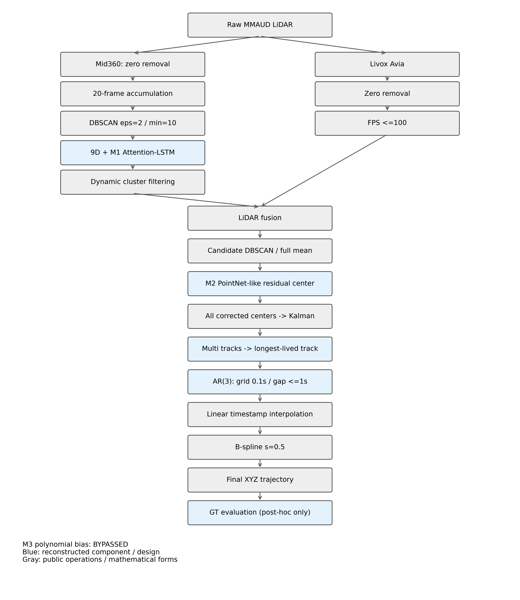

# MMUAV Reproduction Pipeline

## 总体流程



M3 polynomial bias = **BYPASSED**。这是公开算法与明确重建组件组成的定位分支，不是已确认的论文完整原实现。

## 每一步输入、操作、输出与目的

### Mid360 preprocess

- 输入：20 raw frames
- 操作：去零、累计、DBSCAN eps=2/min=10、9D feature、M1分类
- 输出：按帧保留动态簇
- 解决问题：稀疏点的时间结构与背景剔除

### Livox preprocess

- 输入：raw Avia [N,>=3]
- 操作：去零；作者FPS最多100点
- 输出：processed points
- 解决问题：限制点数且保留空间覆盖

### Fusion

- 输入：两传感器processed点及时间戳
- 操作：作者时间组织和fusion DBSCAN
- 输出：lidar_fusion NPY
- 解决问题：合并两传感器观测

### Candidate clustering

- 输入：每帧fusion点
- 操作：DBSCAN eps=1/min=1；全部有效簇均保留；完整簇求mean
- 输出：[Ni,3]点簇及[3]中心
- 解决问题：形成每时刻全部测量候选

### M1 classifier

- 输入：[B,20,9]
- 操作：LSTM(9,64,1)，所有hidden states标量attention，Linear(64,2)
- 输出：logits [B,2]; attention [B,20]
- 解决问题：时间动态簇分类；仅logits决定类别

### M2 center regression

- 输入：local points [B,64,3] + observed center [B,3]
- 操作：shared MLP 3/64/128/256、max pool、concat center、259/128/64/3
- 输出：delta [B,3]; center+delta
- 解决问题：从观测形状与绝对位置学习中心偏移

### Kalman tracking

- 输入：每timestamp全部[K,3]中心
- 操作：StoneSoup CV Kalman + nearest-neighbour；归档多track
- 输出：timestamp/track_id/XYZ/velocity/update
- 解决问题：关联和滤波；不使用GT

### Track selection

- 输入：multi-track states
- 操作：最长duration；tie按measurement count再初始XYZ
- 输出：selected [T,3]
- 解决问题：固定、无GT的唯一轨迹选择

### AR(3)

- 输入：selected track
- 操作：各轴三阶OLS，0.1s grid，最多补1s内部gap；短序列fallback
- 输出：completed trajectory
- 解决问题：补短期失测；不是GT拟合

### Interpolation

- 输入：completed track及查询时间
- 操作：线性插值；禁止support外预测；大gap保持missing
- 输出：interpolated [Tprime,3]
- 解决问题：统一时间坐标；只允许GT timestamp、不允许GT XYZ

### B-spline

- 输入：completed states
- 操作：splrep/splev，s=0.5，k=3；有效点不足时线性；同support mask
- 输出：smoothed final XYZ
- 解决问题：固定时间平滑；本轮不重新拟合

### Evaluation

- 输入：已生成预测 + GT
- 操作：冻结timestamp tolerance=0.05s；matched-only error + missing/coverage
- 输出：overall/per-sequence metrics
- 解决问题：区分定位误差与轨迹完整性

### Finalization

- 输入：现有CSV/metrics/cache
- 操作：共同timestamp比较、长尾统计、离线诊断及绘图
- 输出：报告、CSV、PNG、manifest
- 解决问题：规范解释并封存既有实验

## 算法与实际代码映射

| Stage | Input | Core operation | Output | Our code | Function/Class | Public/Reconstructed |
|---|---|---|---|---|---|---|
| Mid360 preprocess | 20 raw frames | 去零、累计、DBSCAN eps=2/min=10、9D feature、M1分类 | 按帧保留动态簇 | `tools/build_mmuav_center_regression_dataset.py` | `preprocess; logits_only` | PUBLIC operations + reconstructed M1 adapter |
| Livox preprocess | raw Avia [N,>=3] | 去零；作者FPS最多100点 | processed points | `src/rdq_uav/baselines/mmuav_preprocess.py` | `process_lidar_livox; farthest_point_sample` | PUBLIC |
| Fusion | 两传感器processed点及时间戳 | 作者时间组织和fusion DBSCAN | lidar_fusion NPY | `src/rdq_uav/baselines/mmuav_preprocess.py` | `process_fusion` | PUBLIC |
| Candidate clustering | 每帧fusion点 | DBSCAN eps=1/min=1；全部有效簇均保留；完整簇求mean | [Ni,3]点簇及[3]中心 | `tools/run_mmuav_pose_pipeline.py` | `infer_candidates` | PUBLIC clustering + reconstructed callable adapter |
| M1 classifier | [B,20,9] | LSTM(9,64,1)，所有hidden states标量attention，Linear(64,2) | logits [B,2]; attention [B,20] | `src/rdq_uav/mmuav/attention_lstm.py` | `AttentionLSTMClassifier.forward` | RECONSTRUCTED DESIGN |
| M2 center regression | local points [B,64,3] + observed center [B,3] | shared MLP 3/64/128/256、max pool、concat center、259/128/64/3 | delta [B,3]; center+delta | `src/rdq_uav/mmuav/center_regressor.py` | `CenterRegressor.forward; sample_local; predict_delta` | RECONSTRUCTED DESIGN |
| Kalman tracking | 每timestamp全部[K,3]中心 | StoneSoup CV Kalman + nearest-neighbour；归档多track | timestamp/track_id/XYZ/velocity/update | `src/rdq_uav/mmuav/pose_trajectory.py` | `track_candidates` | PUBLIC parameters + reconstructed output/archive wrapper |
| Track selection | multi-track states | 最长duration；tie按measurement count再初始XYZ | selected [T,3] | `src/rdq_uav/mmuav/pose_trajectory.py` | `select_track` | RECONSTRUCTED DESIGN |
| AR(3) | selected track | 各轴三阶OLS，0.1s grid，最多补1s内部gap；短序列fallback | completed trajectory | `src/rdq_uav/mmuav/pose_trajectory.py` | `ar_complete` | RECONSTRUCTED DESIGN |
| Interpolation | completed track及查询时间 | 线性插值；禁止support外预测；大gap保持missing | interpolated [Tprime,3] | `src/rdq_uav/mmuav/pose_trajectory.py` | `resample(smooth=False)` | PUBLIC mathematical form + reconstructed support rules |
| B-spline | completed states | splrep/splev，s=0.5，k=3；有效点不足时线性；同support mask | smoothed final XYZ | `src/rdq_uav/mmuav/pose_trajectory.py` | `resample(smooth=True)` | PUBLIC mathematical form + reconstructed support rules |
| Evaluation | 已生成预测 + GT | 冻结timestamp tolerance=0.05s；matched-only error + missing/coverage | overall/per-sequence metrics | `tools/run_mmuav_pose_pipeline.py` | `score; main` | RECONSTRUCTED local evaluator |
| Finalization | 现有CSV/metrics/cache | 共同timestamp比较、长尾统计、离线诊断及绘图 | 报告、CSV、PNG、manifest | `tools/finalize_mmuav_reproduction.py; tools/document_mmuav_archive.py` | `main; diagnose; visualizations; documentation` | RECONSTRUCTED offline reporting |

## Data Flow / Tensor Shape

```text
Raw [N,>=3] → XYZ [N,3]
Mid360 20-frame → feature [B,20,9] → M1 logits [B,2]
Fusion → candidates [Ni,3] → full-cluster geometric center [3]
sample_local [64,3] + observed center [3] → M2 delta [3] → corrected center [3]
per timestamp [K,3] → Kalman [x,vx,y,vy,z,vz]
selected [T,3] → AR/interpolation/spline [Tprime,3]
final CSV: timestamp,x,y,z (missing retained as NaN)
```

几何中心在采样前由完整簇求mean；GT从不进入M2 forward。M2模块级2359个GT-conditioned validation样本不充当系统输入。系统中全部合法候选进入tracker，GT XYZ只在预测生成后评价。

## Public / Reconstructed边界

PUBLIC：Mid360累计/去零/DBSCAN及9D提取、Livox FPS、fusion、候选DBSCAN、作者StoneSoup基础参数、线性插值和B-spline数学形式。RECONSTRUCTED：M1 attention、M2 PointNet-like残差回归、无GT最长track选择、AR3具体OLS与fallback、support/gap规则和本地评价器。M3旁路。训练DBSCAN eps=1与系统Mid360 eps=2存在公开代码差异，M1分类validation F1不可解释成系统候选检测100%。

## 三条冻结系统路径

GEOMETRIC与FULL使用同tracker/selection；FULL对所有候选应用M2。FULL_TEMPORAL再用AR3、interpolation和spline。heldout使用冻结配置一次独立评价，没有根据heldout调参。误差只在matched timestamps上计算，coverage和missing同时保留。

## 图表与有限诊断

代表选择见visualization_selection.json：排除已知heavy-tail seq0065仅用于主展示，在其余有效sequence中选mean error最接近中位数者；等距按sequence ID打破tie。seq0065仍计入所有正式结果并独立展示。图1原始DBSCAN标签未缓存：Panel 2按实际frame timestamp着色而不是伪造簇编号；Panel 3由保存的processed点匹配重建。未重新运行DBSCAN或模型。所有绘图采样仅用于降低显示密度，不改变任何中心、预测或评分。

missing分类是互斥的近端support规则归因，不是唯一传感器根因。511点超出selected track范围，17点为gap拒绝；337个missing时间附近无保存候选，该标记与support原因重叠。

MMUAV REPRODUCTION ARCHIVED AND CLOSED
